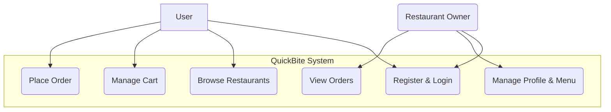
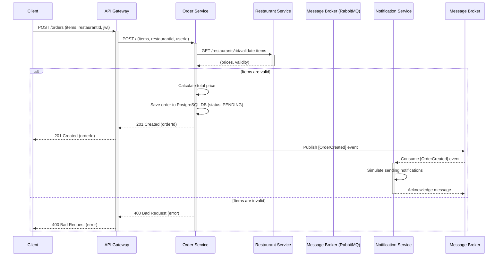
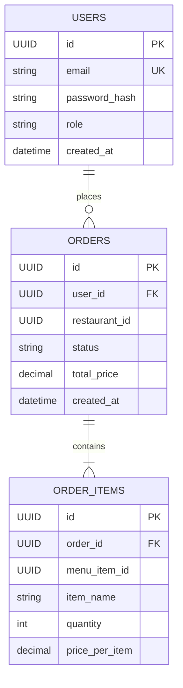

# QuickBite: A Microservices Food Delivery API

QuickBite is a backend application for a food delivery service built using a event-driven microservices architecture. It provides a scalable and resilient foundation for connecting users with restaurants.

## Project Goals & Purpose

This project was specifically designed to serve as a portfolio piece to demonstrate proficiency in several key areas of software engineering. It directly addresses feedback related to the following competencies:

- **Software Requirements & Elicitation:** The project is founded on a complete set of requirement artifacts, including a Project Vision, User Stories, and detailed Functional/Non-Functional Requirements documentation.
- **System Design & Diagramming:** The architecture is visually represented through UML Use Case and Sequence diagrams. The data persistence layer is defined with an Entity-Relationship (ER) Diagram for relational data and a clear document model for NoSQL data.
- **Distributed Systems Architecture:** Demonstrates a practical understanding of Microservices, Service-Oriented Architecture (SOA), and Event-Driven Architecture (EDA) through the use of independent services communicating via a message broker.
- **Database Knowledge (SQL vs. NoSQL):** Intentionally uses both PostgreSQL (SQL) for transactional data (users, orders) and MongoDB (NoSQL) for flexible, document-based data (restaurant menus) to showcase an understanding of their respective strengths and use cases.
- **Software Construction & CI/CD:** The project is set up for automated builds and testing using GitHub Actions, demonstrating modern CI practices.
- **Design Patterns:** The codebase will leverage fundamental design patterns (e.g., Repository, Dependency Injection) to ensure maintainable and clean code.

## System Architecture

The system is composed of five independent microservices and an API Gateway, which communicate asynchronously via a RabbitMQ message broker.

### Use Case Diagram


### "Place Order" Sequence Diagram


## Data Models

### PostgreSQL ER Diagram


## Technology Stack
- **Framework:** Node.js with NestJS (TypeScript)
- **Containerization:** Docker & Docker Compose
- **Databases:**
  - PostgreSQL (for Identity & Order services)
  - MongoDB (for Restaurant service)
- **Message Broker:** RabbitMQ
- **API Gateway:** Express Gateway
- **Testing:** Jest

## Getting Started
### Prerequisites
- Docker and Docker Compose installed on your machine.

### Installation & Running
1.  **Clone the repository:**
    ```bash
    git clone <your-repo-url>
    cd quickbite-project
    ```
2.  **Run the entire application stack:**
    ```bash
    docker-compose up -d
    ```
This command will build the Docker images for each service (if not already built) and start all the containers defined in the `docker-compose.yml` file.

The API Gateway will be available at `http://localhost:3000`.

## Services Overview

| Service | Responsibility | Database |
| :--- | :--- | :--- |
| **API Gateway** | Single entry point for all client requests. | None |
| **Identity Service** | User registration, login, JWT generation. | PostgreSQL |
| **Restaurant Service** | Manages restaurant profiles and menus. | MongoDB |
| **Order Service** | Manages order creation, state, and history. | PostgreSQL |
| **Notification Service** | Listens for events and sends mock notifications. | None |

