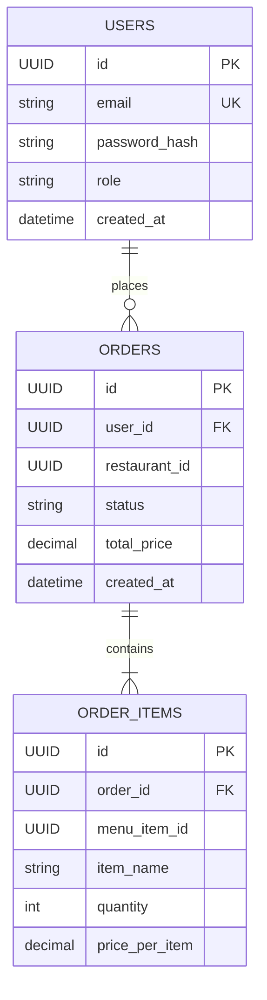

```mermaid
erDiagram
    USERS {
        UUID id PK
        string email UK
        string password_hash
        string role
        datetime created_at
    }

    ORDERS {
        UUID id PK
        UUID user_id FK
        UUID restaurant_id
        string status
        decimal total_price
        datetime created_at
    }

    ORDER_ITEMS {
        UUID id PK
        UUID order_id FK
        UUID menu_item_id
        string item_name
        int quantity
        decimal price_per_item
    }

    USERS ||--o{ ORDERS : places
    ORDERS ||--|{ ORDER_ITEMS : contains
```
