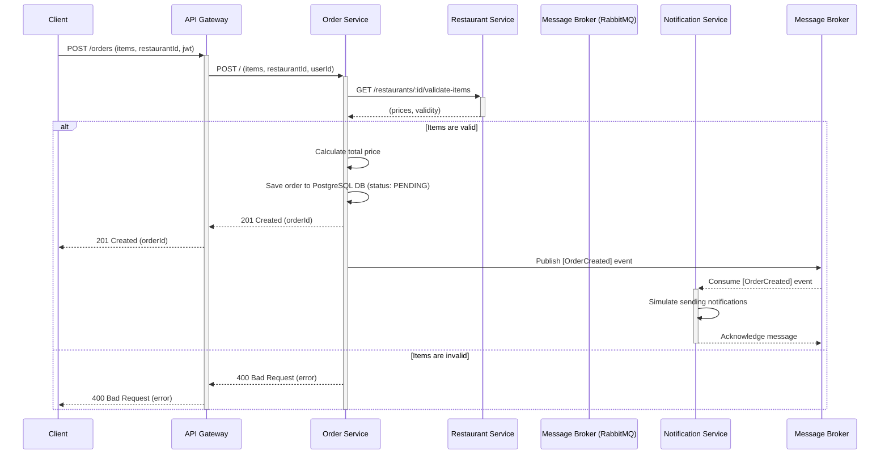

```mermaid

sequenceDiagram
    participant Client
    participant API Gateway
    participant Order Service
    participant Restaurant Service
    participant Message Broker (RabbitMQ)
    participant Notification Service

    Client->>+API Gateway: POST /orders (items, restaurantId, jwt)
    API Gateway->>+Order Service: POST / (items, restaurantId, userId)
    
    Order Service->>+Restaurant Service: GET /restaurants/:id/validate-items
    Restaurant Service-->>-Order Service: (prices, validity)

    alt Items are valid
        Order Service->>Order Service: Calculate total price
        Order Service->>Order Service: Save order to PostgreSQL DB (status: PENDING)
        Order Service-->>API Gateway: 201 Created (orderId)
        API Gateway-->>Client: 201 Created (orderId)
        
        Order Service->>Message Broker: Publish [OrderCreated] event
        
        Message Broker-->>+Notification Service: Consume [OrderCreated] event
        Notification Service->>Notification Service: Simulate sending notifications
        Notification Service-->>-Message Broker: Acknowledge message
    else Items are invalid
        Order Service-->>API Gateway: 400 Bad Request (error)
        API Gateway-->>Client: 400 Bad Request (error)
    end
    
    deactivate Order Service
    deactivate API Gateway
```
