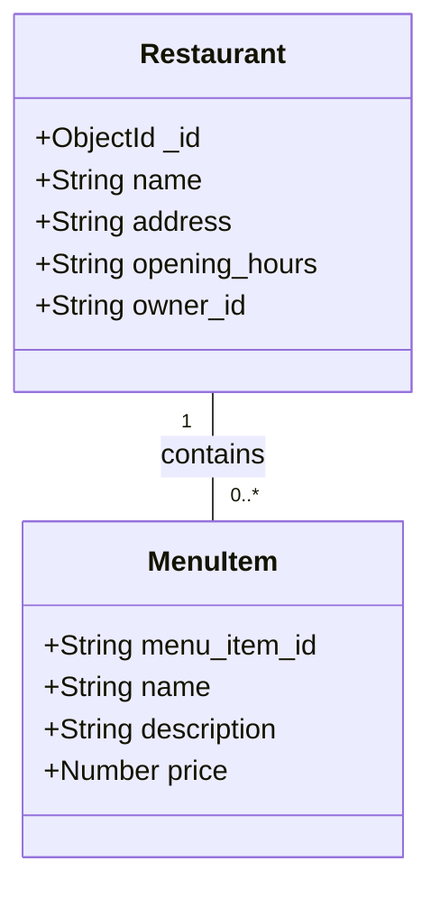

```mermaid
classDiagram
    class Restaurant {
        +ObjectId _id
        +String name
        +String address
        +String opening_hours
        +String owner_id
    }

    class MenuItem {
        +String menu_item_id
        +String name
        +String description
        +Number price
    }

    Restaurant "1" -- "0..*" MenuItem : contains
```
