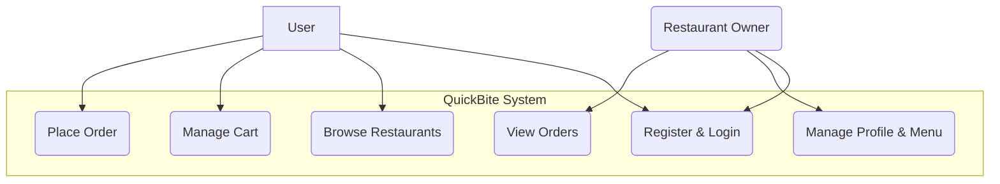

```mermaid
graph TD
    subgraph QuickBite System
        UC1(Register & Login)
        UC2(Browse Restaurants)
        UC3(Manage Cart)
        UC4(Place Order)
        UC5(Manage Profile & Menu)
        UC6(View Orders)
    end

    User --> UC1
    User --> UC2
    User --> UC3
    User --> UC4

    RestaurantOwner(Restaurant Owner) --> UC1
    RestaurantOwner(Restaurant Owner) --> UC5
    RestaurantOwner(Restaurant Owner) --> UC6
```